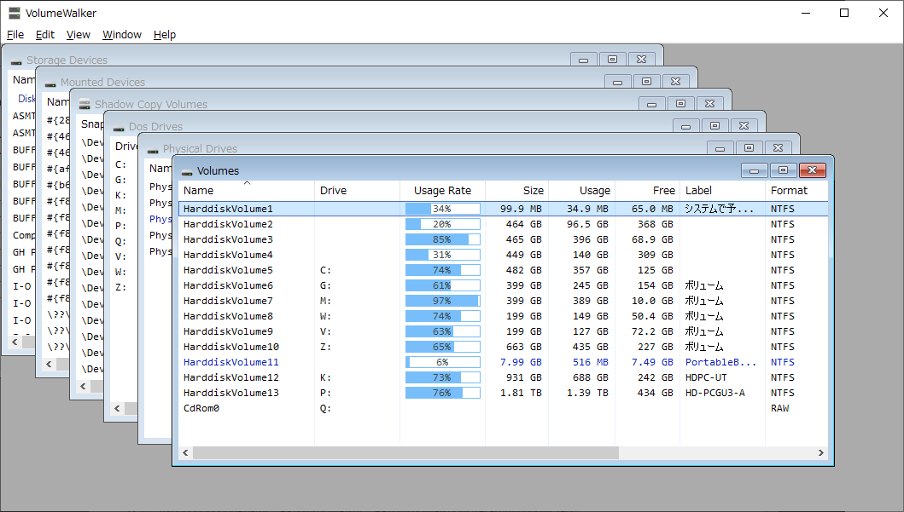

# FSVolumeWalker
 
Version 0.1 Preview

ボリュームの情報を表示します。

Windows APIやIOCTL,FSCTLで取得できるボリュームやドライブの情報を表示します。
MDI Win32アプリケーションのひな形を用いて、[FSWorkbench](https://github.com/yamashita-software-works/FSWorkbench) 
など過去に作成したソフトウェアから、ボリュームやディスクストレージ関係のコードを抜粋し整理・再構築したアーカイブまたはサンプルアプリケーション的な位置づけです。

 

### 表示できる情報ウィンドウ

メニューの File から開きます。

- Volumes   
ボリュームの一覧を表示します。

- Physcical Drives   
物理ドライブの一覧を表示します。

- Storage Devices   
過去も含めPCに接続されたストレージデバイスの一覧を表示します。

- Mounted Devices   
過去も含めマウントされたデバイスの識別子の一覧を表示します。

- Shadow Copy Drives   
ボリュームシャドウコピー（スナップショット）の一覧を表示します。

- MS-DOS Drives   
ドライブの一覧を表示します。

以下のウィンドウは Volumes ウィンドウから項目を選択しダブルクリックまたはメニューから開きます。

- Volume Information   
選択されたボリュームの詳細情報を表示します。

以下のウィンドウは Physical Drives ウィンドウから項目を選択しダブルクリックまたはメニューから開きます。

- Disk Drive Information   
選択された物理ドライブの詳細情報を表示します。

- Disk Drive Layout   
選択された物理ドライブのパーティションレイアウトを表示します。

 

### インストール

1. GitHub Releaseから目的の書庫ファイルをダウンロードします。

1. 書庫ファイルを適切なフォルダへ展開します。

 

### 使い方

1. fsvolumewalker.exeを実行します。

1. `File` メニューから目的のウィンドウを選択します。

 

## Build

### 開発環境
ソースからビルドするには　Windows Driver Kit Version 7.1.0 (WDK) と Windows SDK for Windows 7 and .NET Framework 4 (Veriosn 7.1)が必要です。

https://www.microsoft.com/en-us/download/details.aspx?id=11800

https://www.microsoft.com/en-us/download/details.aspx?id=8442

>ISOファイルを使ってSDKをインストールする場合、プラットフォームごとに異なるので注意してください。   
>64bit環境にインストールする時は GRMSDKX_EN_DVD.iso を、
>32bit環境にインストールする時は GRMSDK_EN_DVD.iso をダウンロードしてください。
>適合しないファイルを使用するとエラーとなりインストールできません。

現在のビルド環境は、上記WDKとSDKが以下の場所にインストールされている前提になっています。WDKはデフォルトで下記の場所になっていますが、SDKのデフォルトは異なっているので注意してください。

WDK   
`C:\WinDDK\7600.16385.1`

SDK   
`C:\WinSDK\7.1`

もし別の場所にインストールされている場合は、その場所へのリンクを持つ上記パスと同じ名前のジャンクションポイントをC:ドライブのルートに作成すると便利です。

例)
`C:\WinSDK\7.1 -> C:\Program Files\Microsoft SDKs\v7.1`

>
>ビルドに使用するsourcesファイル内に記述されたWDK/SDKルートパスがハードコードされているためです。
>独自のインストール先を設定したい場合は、sourcesファイルを編集して当該パスを調整する必要があります。
>編集する場合、sourcesファイルに記述するパスにはスペースを含めないでください。

>
>SDKのセットアップは、マウントされた(またはCD/DVD)ドライブのルートにあるsetup.exeではなく、Setupフォルダ下のSDKSetup.exe を実行してください。   
> `\Setup\SDKSetup.exe`
>
>
>もしインストール時にエラーが発生した場合は、以下のVS2010再頒布モジュールをアンインストールしてから再度試してみてください。
>
>`Microsoft Visial C++ 2010 x86 Redistributable - 10.0.xxxxx`   
>`Microsoft Visial C++ 2010 x64 Redistributable - 10.0.xxxxx`

>
>SDKから最低限インストールが必要なものは、ヘッダファイルとライブラリファイルのみです。コンパイラやツールは不要です。

 

### ビルド方法
スタートメニューの以下の項目を開きます。

`Windows Driver Kits > WDK 7600.16385.1 > Build Environments > Windows 7`

から

64ビット版をビルドする場合は、`x64 Free Build Environment`

32ビット版をビルドする場合は、`x86 Free Build Environment`

のどちらかを開きます。

>Windows 10ではスタートメニューから目的の環境を開けない場合があります。スタートメニューに配置される各開発環境別フォルダ下に、同じ名前の.lnkファイルが存在している為で、Windows 10のスタートメニューはこの様な配置を正しく扱えない様です。   
>その場合はスタートメニューの項目を右クリックし、\[ファイルの場所を開く\]を選択してフォルダを開いてから、Windows 7のフォルダへ移動して開いてください。   
>※Windows 11ではビルド環境の構築を確認できていません。

 
コマンドプロンプトが開くので、ソースの展開先ディレクトリへ移動して、以下の`build`コマンドを実行します。
 
 

    build -c

リンクのエラーが出る場合または確実なビルドを行う場合、以下のオプションを試してください。

    build -c -M 1

## License

Copyright (C) YAMASHITA Katsuhiro. All rights reserved.

Licensed under the [MIT](LICENSE) License.
